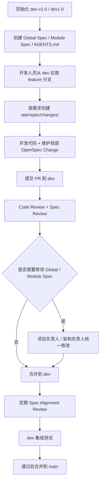

# Git 分支与交付规范

本规范用于桌面智算项目的多人协作、OpenSpec 追踪和 AI Coding 交付。Git 分支负责把代码变更、OpenSpec Change、验证记录和提交记录绑定在一起；不用于替代需求规格。

## 分支模型

```text
main
  ↑
dev / dev-v1.0
  ↑
feature/*
```

当前仓库既有规范使用 `dev1.0`；团队如采用 `dev-v1.0`，必须先统一远端分支名和 PR 目标。文档中的 `dev` 指开发集成分支，可以落地为 `dev1.0` 或 `dev-v1.0`，但一个仓库只能保留一个主用名称。



## main 分支

`main` 是生产稳定分支。

要求：

- 只接收经过验证的稳定代码。
- 保存与当前稳定代码匹配的 Global Spec、Module Spec、AGENTS.md 和必要的 OpenSpec 快照。
- 不允许直接开发，不允许直接提交。
- 只能通过 `dev` 集成分支合并进入。
- `main` 中的代码、Global Spec、Module Spec、AGENTS.md 必须互相匹配。
- 合并前必须确认 `dev` 已完成集成测试和 Spec Alignment Review。
- 合并后按发布版本打 tag。

## dev / dev-v1.0 分支

`dev` 是开发集成分支。

要求：

- 存放当前集成代码。
- 存放当前 Global Spec、Module Spec、AGENTS.md。
- 存放当前开发中的 OpenSpec Changes。
- 所有 `feature/*` 分支从 `dev` 拉取。
- 所有 `feature/*` 分支合并回 `dev`。
- `dev` 必须保持代码与 Spec 同步，不允许长期存在“代码已改、Spec 未改”的状态。

## feature 分支

`feature` 分支可以按人、模块或阶段划分，不强制每个需求一个分支。

推荐命名：

```text
feature/zs-task-module
feature/ls-data-module
feature/ww-agent-module
feature/frontend-project-module
feature/backend-task-runtime
```

要求：

- 开发人员从 `dev` 拉取自己的 `feature` 分支。
- 在 `feature` 分支中同时维护代码和对应 OpenSpec Change。
- 分支可以按人或模块划分，但 OpenSpec Change 必须按需求划分。
- 不允许用“个人 spec”替代正式 OpenSpec Change。
- 建议 3 到 5 天内合并一次小 PR，避免长期积累未合并需求。

## 代码目录、Spec 目录和分支名的关系

`feature/task-001` 或 `feature/zs-task-module` 是 Git 分支名，不是代码目录名。

核心原则：

```text
代码按模块组织；
Spec Change 按需求组织；
Git 分支负责把代码变更和需求 Spec 绑定起来。
```

当前仓库代码按模块位于：

```text
frontend/
backend/
agent/
packages/shared/
```

OpenSpec Change 按需求位于：

```text
openspec/changes/<change-id>/
```

不要为了某个需求创建零散的 `src/task-001/`、`src/feature-x/` 目录。代码必须落在真实系统模块中。

## 提交规范

提交格式：

```text
<type>(<scope>): <summary>
```

常用类型：

- `feat`：功能实现
- `fix`：缺陷修复
- `docs`：开发文档或说明
- `spec`：OpenSpec / 需求规格
- `test`：测试
- `refactor`：不改变行为的重构
- `chore`：工程维护

要求：

- 一个 commit 只表达一个清晰意图。
- 功能代码、Spec、测试可以在同一 PR 中，但不要把多个无关需求塞进一个 commit。
- 每个可交付变更必须能回溯到 `openspec/changes/<change-id>`。
- 不允许跳过验证后声称完成。
