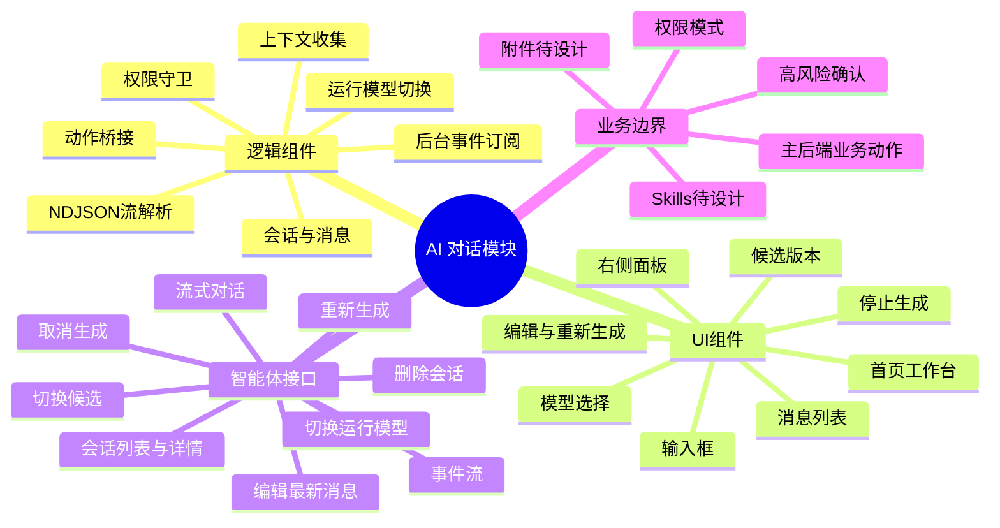

# AI 对话与智能体接口替换详解

AI 对话、会话、运行模型切换、后台事件流由智能体后端维护；
AI 模型配置仍按设置页模型配置接口维护。
主后端业务接口只处理首页、项目、任务、数据、模型、设置等业务动作。

## 总览

AI 模块分为两套：

- 逻辑组件：负责上下文收集、会话状态、流式事件解析、模型配置状态、运行模型切换、权限判断、错误处理。
- UI 组件：负责输入框、消息列表、附件入口、模型选择、快捷问题、状态提示、停止生成、重新生成、编辑消息、候选版本切换、确认弹窗。

使用位置：

- 首页 `/`：中间区域 AI 工作台。
- 项目、任务、数据、模型、设置：右侧复用 AI 对话面板。

统一边界：

- AI 可以生成建议、草稿、解释和动作卡片，但不能绕过主后端业务接口执行创建、删除、启动、停止、修复、清理等动作。
- 业务动作必须由前端展示影响范围并二次确认，再调用对应业务模块接口。
- 智能体后端不可用时，不影响业务页面的基础使用。
- 流式对话接口返回 `application/x-ndjson`，前端按事件行增量解析，不能按普通统一 JSON 响应解析。

## 思维导图



## 1. 模块定位

### 组件方面

- 首页 AI 工作台：
  - 输入自然语言需求。
  - 展示推荐问题。
  - 选择当前项目。
  - 选择 AI 模型。
  - 进入 Plan 模式入口。
  - 查看或装载 Skills。
  - 上传或引用附件。
  - 展示后台提醒。

- 右侧 AI 对话面板：
  - 绑定当前页面上下文。
  - 支持发送、停止、编辑最新用户消息、重新生成最新回答。
  - 支持多个 assistant 候选回答切换。
  - 展示工具调用过程。
  - 展示 AI 动作建议卡片。
  - 对高风险动作弹出确认。

### 页面状态

- `idle`：输入框可用。
- `sending`：请求已发起，等待首个流式事件。
- `streaming`：接收 `delta`、`tool`、`done`、`error` 事件。
- `cancelling`：用户点击停止生成。
- `editing`：编辑最新用户消息并重新生成。
- `regenerating`：重新生成最新回答。
- `switching_candidate`：切换候选回答。
- `loading_sessions`：加载历史会话。
- `loading_session_detail`：打开历史会话。
- `deleting_session`：删除历史会话。
- `switching_model`：切换当前运行模型。
- `model_unavailable`：默认或选中模型不可用。
- `agent_backend_unavailable`：智能体后端不可用。
- `confirm_required`：AI 建议动作需要二次确认。
- `business_api_failed`：AI 动作桥接到主后端业务接口失败。

### Mock 数据来源

- 推荐问题：按页面静态配置。
- 当前上下文：从路由参数和页面已加载数据组装。
- 会话列表：替换为 `GET /api/sessions`。
- 历史消息：替换为 `GET /api/sessions/{session_key}`。
- 模型列表：替换为设置页 AI 模型配置接口。
- 运行模型：替换为 `POST /api/runtime/model`。
- 权限模式：前端本地状态或智能体后端后续接口。
- Skills：智能体后端后续接口待设计。
- 附件：智能体后端后续接口待设计，是否复用文件服务待确认。

## 2. 逻辑组件

|逻辑组件|职责|输入|输出|
|---|---|---|---|
|`AIContextProvider`|汇总当前页面上下文|`page`、`route`、`projectId`、`taskId`、`datasetId`、`modelId`、`envId`|标准化上下文对象|
|`AIConversationStore`|管理会话、消息、候选版本和发送状态|用户输入、会话 ID、channel、上下文|消息列表、当前候选、发送状态、错误|
|`AIStreamClient`|解析 `/api/chat/stream`、`edit-latest`、`regenerate-latest` 的 NDJSON|请求体、AbortController|`delta/tool/done/error` 事件|
|`AIEventSubscriber`|订阅后台事件流|`conversation_id`、`channel`|后台 assistant message、断线重连状态|
|`AISessionStore`|管理历史会话|sessions 接口|会话列表、会话详情、删除状态|
|`AIModelConfigStore`|管理 AI 模型配置状态|设置页模型配置接口|默认模型、可用模型、测试状态|
|`AIRuntimeModelStore`|切换当前运行模型|`modelConfigId`|运行时模型信息、可用模型刷新|
|`AIActionBridge`|将 AI 建议动作映射到主后端业务接口|AI 动作建议、用户确认|业务接口调用结果|
|`AIPermissionGuard`|控制只读建议、辅助填写、确认后执行|权限模式、动作风险|是否允许执行、是否需要确认|
|`AIAttachmentManager`|管理附件选择与上传状态|文件、路径、大小、类型|附件引用、上传状态|

## 3. UI 组件

|UI 组件|使用位置|说明|
|---|---|---|
|`AIWorkbench`|首页中间区域|首页主 AI 工作台，承载输入、快捷问题、模型选择、Plan 入口|
|`AISidePanel`|项目/任务/数据/模型/设置右侧|复用型侧边 AI 面板|
|`AIMessageList`|工作台/侧边栏|展示用户消息、AI 回复、错误、建议动作|
|`AIStreamMessage`|消息列表|渲染流式增量内容和完成态|
|`AIToolCallItem`|消息列表|展示 `tool` 事件的工具名、状态、摘要、耗时|
|`AIInputBox`|工作台/侧边栏|输入自然语言需求，支持发送和停止|
|`AIModelSelect`|工作台/侧边栏|选择默认或指定 AI 模型|
|`AIPermissionModeSelect`|工作台/侧边栏|只读建议、辅助填写、确认后执行|
|`AIQuickPrompts`|各模块|展示与当前页面相关的推荐问题|
|`AIAttachmentButton`|输入区|上传或引用文件，接口待设计|
|`AIMessageActions`|最新消息|编辑、重新生成、切换候选版本|
|`AISessionList`|历史会话入口|展示、打开、删除历史会话|
|`AIActionConfirmDialog`|执行动作前|高风险动作二次确认|
|`AIBackendStatus`|输入区/顶部|展示模型不可用、后端不可用、权限冲突等状态|

## 4. 页面上下文

|页面|上下文字段|推荐动作|
|---|---|---|
|首页 `/`|`currentProjectId`、资源摘要、最近操作|资源诊断、训练建议、清理建议|
|项目 `/projects/:projectId`|`projectId`、当前 Tab、关联数据/任务/模型摘要|总结项目、检查完整性、创建训练任务草稿|
|任务 `/tasks/:taskId`|`taskId`、状态、指标、日志引用、输出引用|分析日志、解释指标、生成报告、复制参数|
|数据 `/data/:datasetId`|`datasetId`、格式、结构画像、检查结果|检查数据、生成 data.yaml 草稿、解释警告|
|模型 `/models/:modelId`|`modelId`、类型、来源任务、检查结果|检查模型、推荐部署配置|
|设置 `/settings`|`tab`、`envId`、AI 模型配置 ID|环境诊断、模型配置解释|

上下文传递建议：

- 对话接口的 `metadata` 只传页面上下文、业务资源 ID 和前端状态摘要。
- `metadata` 内部字段以下划线开头会被后端过滤，前端不要依赖下划线字段持久化。
- 大体积日志、文件内容、数据画像不建议直接塞入 `metadata`，应传引用 ID 或摘要。

## 5. 智能体接口替换点

|来源章节|智能体接口|前端替换位置|输入/参数|输出关注|
|---|---|---|---|---|
|对话 - 发起流式对话|`POST /api/chat/stream`|发送新消息|`message`、`conversation_id`、`channel`、`metadata`|`delta` 增量、`tool` 调用、`done.reply`、`tools_used`、`session_key`|
|对话 - 编辑最新用户消息并重新生成|`POST /api/chat/edit-latest`|编辑最新用户消息|`message`、`conversation_id`、`channel`、`metadata`|返回格式同流式对话；失败时提示无可编辑消息或会话运行中|
|对话 - 重新生成最新回答|`POST /api/chat/regenerate-latest`|重新生成按钮|`conversation_id`、`channel`、`metadata`|生成新的 assistant 候选回答|
|对话 - 切换最新回答候选版本|`POST /api/chat/switch-candidate`|候选版本切换|`conversation_id`、`channel`、`candidate_id`|更新 `candidate_active`|
|对话 - 后台事件流|`GET /api/events`|后台提醒、异步完成消息|Query：`conversation_id`、`channel`|`message` 事件、`event_id`、断线 backlog|
|对话 - 停止当前生成|`POST /api/chat/cancel`|停止生成按钮|`conversation_id`、`channel`|`cancelled=true/false`|
|会话 - 查询会话列表|`GET /api/sessions`|历史会话列表|无|`sessions[].key`|
|会话 - 查询会话详情|`GET /api/sessions/{session_key}`|打开历史会话|路径参数 `session_key`，前端需 `encodeURIComponent`|`session.messages`|
|会话 - 删除会话|`DELETE /api/sessions/{session_key}`|删除历史会话|路径参数 `session_key`，前端需 `encodeURIComponent`|`deleted`、`session_key`|
|模型 - 切换当前运行模型|`POST /api/runtime/model`|模型选择器切换后生效|`modelConfigId`|运行模型、provider、上下文长度、输出长度、温度、可用模型列表|

## 6. 流式事件处理

### 6.1 发起对话

请求：

```json
{
  "message": "你好",
  "conversation_id": "same",
  "channel": "runtime",
  "metadata": {
    "page": "task_detail",
    "taskId": "task_001"
  }
}
```

前端处理：

- 请求开始后进入 `sending`。
- 收到首个 `delta` 或 `tool` 后进入 `streaming`。
- `delta.content` 追加到当前 assistant 草稿消息。
- `tool` 事件追加或更新工具调用列表，按 `call_id` 和 `sequence` 合并展示。
- `done.ok=true` 时，将草稿消息提交为完成消息，并保存 `conversation_id`、`channel`、`session_key`。
- `error` 事件或网络错误时，保留用户消息，展示失败并允许重试。

### 6.2 事件类型

|事件类型|含义|前端处理|
|---|---|---|
|`delta`|模型回复文本增量|追加到当前 assistant 消息|
|`tool`|工具调用状态|展示工具名、状态、摘要、耗时和详情入口|
|`done`|当前轮完成|结束 loading，保存最终回复和工具列表|
|`error`|当前轮失败|结束 loading，展示错误，允许重试|
|`message`|后台事件流消息|插入后台提醒或异步完成消息|

### 6.3 停止生成

`POST /api/chat/cancel` 只停止当前 AgentLoop 任务，不删除历史消息。

前端处理：

- 点击停止后进入 `cancelling`。
- `cancelled=true`：当前 assistant 草稿标记为已停止。
- `cancelled=false`：说明当前无运行任务，按钮恢复为发送。
- 停止后仍应允许用户继续发送新消息。

### 6.4 前端消息模型映射

当前智能体接口的流式 `done` 事件只稳定返回 `reply`、`conversation_id`、`channel`、`session_key`、`tools_used` 等字段；历史详情返回 `session.messages`。接口未明确 `message_id`、`turn_id`、创建时间和工具事件持久化结构，因此前端需要建立一层 UI 消息模型，隔离后端字段变化。

前端 UI 消息建议模型：

```json
{
  "uiMessageId": "local-runtime_same-0001",
  "role": "assistant",
  "content": "你好，有什么可以帮你？",
  "status": "streaming",
  "conversationId": "same",
  "channel": "runtime",
  "sessionKey": "runtime:same",
  "turnIndex": 1,
  "candidateId": "candidate_new",
  "candidateActive": true,
  "candidateIndex": 2,
  "toolCalls": [],
  "createdAt": "2026-07-03T10:30:00",
  "source": "stream"
}
```

映射规则：

- `uiMessageId` 由前端生成，只用于渲染和本地列表 diff，不作为后端参数。
- 当前接口没有 `turn_id` 时，前端按消息顺序生成 `turnIndex`；一个 user 消息和其后的一个或多个 assistant 候选消息归为同一轮。
- 流式生成时先创建本地 assistant 草稿消息，`delta.content` 追加到草稿 `content`。
- `tool` 事件按 `call_id`、`sequence` 合并到当前 assistant 草稿的 `toolCalls`。
- `done.reply` 视为最新 active assistant 的最终 `content`；若本地增量内容与 `done.reply` 不一致，以 `done.reply` 为准。
- `done.tools_used` 作为最终工具摘要，补齐或覆盖当前 assistant 消息的 `toolCalls` 摘要。
- 历史详情若返回 `candidate_id`、`candidate_active`、`candidate_index`，前端按这些字段恢复候选版本 UI。
- 历史详情缺少候选字段时，前端降级为普通单版本消息，不展示候选切换控件。
- 历史详情缺少工具记录时，前端只展示最终文本，不回放工具过程。

### 6.5 事件流重连协议

`GET /api/events` 当前只定义 `conversation_id` 和 `channel`，未定义 `last_event_id` query 或 `Last-Event-ID` header。前端第一版按“断线重连 + 本地去重 + 详情兜底”实现。

前端处理口径：

- 连接成功后记录最后一个已处理的 `event_id`。
- 断线后使用指数退避重连，建议间隔为 1s、2s、5s、10s，之后保持 10s。
- 重连时继续使用原 `conversation_id` 和 `channel`；如后端后续支持 `last_event_id`，再追加 query：`last_event_id=<lastEventId>`。
- 重连后收到重复 `event_id` 时直接忽略。
- 如果断线时间较长或怀疑 backlog 超过 50 条，前端应调用 `GET /api/sessions/{session_key}` 重新拉取会话详情兜底。
- `event_id` 当前视为后端内存 backlog 去重标识，不假设跨进程、跨重启永久有效。
- 未收到 `event_id` 的后台消息只展示一次，不参与持久去重。

## 7. 会话与候选版本

会话标识：

- `conversation_id`：前端业务会话 ID，默认 `default`。
- `channel`：会话通道，默认 `runtime`。
- `session_key`：后端持久化键，格式示例 `runtime:same`。
- 前端不能自行用 `channel + ':' + conversation_id` 拼接 `session_key` 作为事实来源，应使用接口返回值。

session key 编码：

- 调用 `GET /api/sessions/{session_key}` 和 `DELETE /api/sessions/{session_key}` 时，前端必须对 `session_key` 使用 `encodeURIComponent`。
- 示例：`runtime:same` 调用时为 `/api/sessions/runtime%3Asame`。
- 后端需要明确支持对路径参数执行 URL decode，再按解码后的真实 session key 查找会话；这是与 `智能体接口.md` 中 `GET /api/sessions/runtime:same` 示例兼容的安全调用方式。
- 如果未来 `session_key` 允许包含 `/`、空格、中文或其他特殊字符，仍按 `encodeURIComponent` 处理。
- 如后端路由无法稳定支持编码后的路径参数，建议后续新增 `GET /api/sessions/detail?session_key=...` 与 `DELETE /api/sessions/detail?session_key=...`，前端再切换 adapter。

候选版本：

- 重新生成不会直接覆盖原回答，而是追加 assistant 候选版本。
- 当前展示以 `candidate_active=true` 为准。
- 切换候选版本后，前端应更新最新一轮 assistant 消息的 active 状态。
- `candidate_id` 只对当前最新一轮回答有效。

历史会话：

- 会话列表接口当前只返回 `key`，前端标题可先从详情首条用户消息截断生成。
- 删除会话是物理删除 session 文件，不是设置页模型配置的软删除。
- `智能体接口.md` 中“查询会话详情”章节重复出现，前端只实现一次 `GET /api/sessions/{session_key}`。

## 8. 运行模型与模型配置

### 8.1 当前运行模型

`POST /api/runtime/model` 只负责切换当前运行模型，不负责新增、编辑、删除模型配置。

前端只传：

```json
{
  "modelConfigId": "550e8400-e29b-41d4-a716-446655440000"
}
```

前端不传 API Key、endpoint、真实 provider 配置。

模型选择器状态机：

|场景|前端选中规则|是否调用接口|
|---|---|---|
|首次进入 AI 工作台/侧边栏|优先使用当前 runtime 模型；如果无当前 runtime 查询接口，则使用模型配置列表中的 `isDefault=true`|当前缺少 `GET /api/runtime/model`，如需精确恢复运行态，建议智能体后端补充|
|用户切换模型|选择 `available` 或允许的 `pending_check` 模型配置|调用 `POST /api/runtime/model`|
|设置默认模型|只更新模型配置默认值|调用 `POST /api/settings/assistant/models/{id}/set-default`，不等同于切换 runtime|
|运行模型切换成功|更新当前 runtime 选中项|不修改模型配置的 `isDefault`|
|运行模型切换失败|保留上一次可用 runtime 选中项|展示失败原因，不清空选择器|
|模型列表为空|输入区禁用发送|提示去设置页新增模型|

模型状态规则：

- `available`：可选，可作为默认模型，可切换为运行模型。
- `pending_check`：可展示；是否允许切换以智能体后端实现为准。当前文档按“允许尝试切换，失败则提示测试模型”处理。
- `unavailable` 或测试失败：可展示但默认禁用切换；允许用户跳转设置页修复或重新测试。
- `deletedAt != null`：不展示在对话模型选择器中。

待补接口建议：

```Plain Text
GET /api/runtime/model
```

用于查询当前 runtime 模型，避免前端只能从默认模型推导。若后端暂不提供，前端以 `isDefault=true` 作为初始选中项，并在用户第一次成功切换后维护本地 runtime 状态。

返回建议：

```json
{
  "ok": true,
  "modelConfigId": "550e8400-e29b-41d4-a716-446655440000",
  "model": "deepseek-v4-flash",
  "providerName": "deepseek",
  "displayName": "DeepSeek V4 Flash",
  "status": "available"
}
```

说明：该接口是后端待补能力，不影响当前前端按默认模型降级实现。

失败场景：

- 模型配置不存在：提示刷新模型列表。
- 模型不可用：提示去设置页测试或修复模型配置。
- 模型配置不完整：提示补齐 endpoint、API Key、modelId。
- provider 初始化失败：提示检查 API Key 或 endpoint。

### 8.2 模型配置接口

以下接口来自 `后端ai助手数据库与接口文档.md`，用于设置页 AI 模型配置和对话模型选择器。

|能力|接口|前端位置|说明|
|---|---|---|---|
|查询模型配置列表|`GET /api/settings/assistant/models`|设置 - AI 模型配置、模型选择器|返回已配置模型，字段在统一响应 `data` 内|
|新增 AI 模型配置|`POST /api/settings/assistant/models`|添加 AI 模型|API Key 加密保存，查询时返回 `apiKeyMasked`|
|编辑 AI 模型配置|`PATCH /api/settings/assistant/models/{id}`|编辑模型配置|支持局部更新|
|设置默认 AI 模型|`POST /api/settings/assistant/models/{id}/set-default`|模型配置列表|默认模型用于 AI 对话和 Plan|
|测试 AI 模型连接|`POST /api/settings/assistant/models/{id}/test`|模型配置列表/编辑抽屉|返回 `status`、`message`、`lastTestAt`|
|删除 AI 模型配置|`DELETE /api/settings/assistant/models/{id}?confirmed=true`|模型配置列表|软删除；默认模型不能直接删除|

设置页模型配置接口使用统一响应。下例只展示响应外壳，实际模型对象位于 `data` 字段内，字段以 `后端ai助手数据库与接口文档.md` 为准：

```json
{
  "success": true,
  "data": {},
  "error": null,
  "requestId": "req-20260702-0001"
}
```

对话、会话、事件、运行模型接口当前使用 `ok` 或 `type` 风格响应。前端需要按接口类型分别适配，不能强制套用设置页统一响应。

## 9. 与主后端业务接口的桥接

AI 建议动作需要经过 `AIActionBridge` 转成主后端业务接口调用。

### 9.1 AI 动作建议结构化协议

当前 `智能体接口.md` 尚未定义结构化动作建议事件。前端不得从自由文本中解析并直接执行业务动作。若后续智能体后端返回动作建议，必须使用以下最小结构，前端只识别白名单 `actionType`。

建议结构：

```json
{
  "actionId": "act_20260703_0001",
  "actionType": "task.start",
  "intent": "require_confirm",
  "resourceType": "task",
  "resourceId": "task_001",
  "title": "启动训练任务",
  "summary": "将启动 task_001，并占用当前默认环境资源。",
  "targetApi": {
    "method": "POST",
    "path": "/api/tasks/task_001/start"
  },
  "payload": {
    "confirmed": true,
    "idempotencyKey": "idem_act_20260703_0001"
  },
  "riskLevel": "high",
  "riskSummary": "启动后会占用 GPU/CPU 资源，可能产生本地输出文件。",
  "requiresConfirm": true,
  "previewRequired": false,
  "permissionModeRequired": "confirm_execute",
  "source": "agent"
}
```

字段约束：

|字段|要求|
|---|---|
|`actionId`|必填，全局唯一或会话内唯一，用于去重和幂等关联|
|`actionType`|必填，只允许前端白名单值，例如 `project.create_draft`、`task.create_draft`、`task.start`、`task.stop`、`task.report.generate`、`dataset.check`、`model.check`、`environment.repair`、`system.cleanup.preview`、`system.cleanup.execute`|
|`intent`|必填，枚举：`suggest_only`、`fill_draft`、`require_confirm`|
|`resourceType/resourceId`|目标资源；创建草稿类动作可无 `resourceId`|
|`targetApi.method/path`|最终业务接口，仅允许映射到主后端已定接口|
|`payload`|业务接口请求体草稿；前端提交前仍需表单校验和二次确认|
|`riskLevel`|枚举：`low`、`medium`、`high`|
|`riskSummary`|中高风险动作必填，用于确认弹窗|
|`requiresConfirm`|高风险和写操作必须为 `true`|
|`previewRequired`|清理等必须先预览的动作设为 `true`|
|`permissionModeRequired`|枚举：`read_only`、`fill_draft`、`confirm_execute`|

执行规则：

- 未知 `actionType`：只展示为不可执行建议，不显示执行按钮。
- `intent=suggest_only`：只展示文本或建议卡片，不写表单，不调接口。
- `intent=fill_draft`：只填入草稿表单，不提交。
- `intent=require_confirm`：展示动作卡片和确认弹窗，用户确认后才调用 `targetApi`。
- `previewRequired=true`：必须先调用预览接口并展示预览结果，再允许执行。
- 高风险动作必须带 `confirmed=true`，建议带 `idempotencyKey`。
- `permissionModeRequired` 高于当前权限模式时，前端应阻止执行并提示切换权限模式。

### 9.2 业务动作映射

|AI 建议动作|主后端接口归属|前端要求|
|---|---|---|
|创建项目草稿|项目模块|用户确认后调用 `POST /api/projects`|
|创建训练/部署任务草稿|任务模块|先展示表单草稿，必要时调用预检|
|启动任务|任务模块|必须二次确认并传 `confirmed=true`|
|停止任务|任务模块|必须二次确认并传 `confirmed=true`|
|生成任务报告|任务模块|建议使用 `idempotencyKey`|
|检查数据集|数据模块|调用数据集检查接口|
|检查模型|模型模块|调用模型检查接口|
|环境检测或修复|设置模块|调用环境接口，修复必须确认|
|清理系统垃圾|首页/系统模块|必须先预览，再确认执行|

权限模式：

- 只读建议：AI 只解释和推荐，不写入表单，不调用业务接口。
- 辅助填写：AI 可以填充草稿表单，但不提交。
- 确认后执行：AI 可以生成动作卡片，用户确认后由前端调用业务接口。

### 9.3 智能体错误码与 UI 映射

当前智能体后端错误多为 `{ ok:false, error:string }`。为避免前端依赖字符串匹配，建议后续扩展为 `{ ok:false, code, error, requestId? }`。在后端补充前，前端 adapter 可按字符串做临时映射，但 UI 层只消费标准 code。

建议后端响应格式：

```json
{
  "ok": false,
  "code": "conversation_running",
  "error": "当前会话正在运行，完成后再试",
  "requestId": "req-20260703-0001"
}
```

兼容要求：前端 adapter 需要同时兼容旧格式 `{ "ok": false, "error": "..." }` 和新格式 `{ "ok": false, "code": "...", "error": "...", "requestId": "..." }`。

|建议错误码|典型来源|UI 处理|
|---|---|---|
|`runtime_not_available`|runtime 未启动或不可用|AI 面板展示服务不可用，保留业务页面|
|`model_config_not_found`|切换运行模型时模型不存在|刷新模型列表，提示重新选择|
|`model_config_unavailable`|模型不可用或测试失败|提示去设置页测试/修复|
|`bad_model_config`|endpoint/API Key/modelId 缺失|提示补齐模型配置|
|`provider_init_failed`|provider 初始化失败|提示检查 API Key 或 endpoint|
|`session_not_found`|打开或删除历史会话 404|从列表移除或提示会话不存在|
|`conversation_running`|会话运行中执行编辑/重试/候选切换|禁用操作并提示等待完成|
|`no_editable_user_message`|编辑最新用户消息失败|隐藏或禁用编辑入口|
|`unknown_candidate`|切换候选失败|刷新会话详情|
|`validation_error`|参数缺失或格式错误|展示字段级或通用校验错误|
|`internal_error`|未知后端错误|展示失败并允许重试|

## 10. 待智能体后端补充的接口

这些能力在 `docs/前端接口替换文档v2.md` 中作为 AI 模块能力出现，但 `智能体接口.md` 尚未形成稳定接口。

|能力|当前处理|前端建议|
|---|---|---|
|Plan 模式|接口待设计|先做 UI 入口和 `planning` 状态，调用接口前加能力开关|
|AI 动作建议结构化协议|接口待设计|先以前端 action schema 约束卡片，不直接执行自由文本动作|
|附件上传|接口待设计|保留入口，限制大小和格式提示，待确认是否复用文件服务|
|Skills 查询/装载|接口待设计|保留展示位，主后端不维护 Skills|
|权限模式持久化|接口待设计|可先使用前端本地状态|
|会话重命名|接口待设计|当前可用首条用户消息生成标题|
|会话搜索/分页|接口待设计|当前会话列表量大时前端本地过滤|

### 10.1 未定能力降级策略

未定能力必须由 feature flag 控制，避免用户误以为已可用。

|Feature flag|默认值|默认 UI|启用前提|
|---|---|---|---|
|`featureFlags.aiPlan`|`false`|显示入口但禁用，tooltip 提示“Plan 模式接口待接入”|智能体后端提供 Plan 接口和状态协议|
|`featureFlags.aiAttachments`|`false`|隐藏上传按钮；如产品要求露出，则禁用并提示“附件上传待接入”|明确附件上传接口、大小限制、文件类型和安全校验|
|`featureFlags.aiSkills`|`false`|显示静态 Skills 占位或隐藏装载按钮|提供 Skills 查询/装载接口|
|`featureFlags.permissionModePersistence`|`false`|权限模式仅本地生效，不跨设备保存|提供权限模式查询/保存接口|
|`featureFlags.aiStructuredActions`|`false`|动作卡片只展示不可执行建议|智能体后端按 9.1 输出结构化动作协议|

降级原则：

- feature flag 关闭时，不发起对应接口请求。
- 禁用按钮必须有明确提示，不使用空点击。
- 隐藏能力不应影响基础对话发送。
- 本地可选的权限模式只影响前端行为，不代表后端工具权限已持久变更。
- `featureFlags.aiStructuredActions` 默认必须为 `false`；在智能体后端未正式按 9.1 输出结构化动作协议前，前端不得把自由文本解析为可执行业务动作。

## 11. 边界限制与实现约束

### 11.1 系统责任边界

|边界项|智能体后端负责|主后端负责|前端负责|
|---|---|---|---|
|AI 对话|生成回复、工具事件、会话持久化|不参与|发送请求、解析流、展示消息和错误|
|历史会话|读取、删除 workspace session 文件|不参与|展示列表、打开详情、删除确认|
|运行模型|按 `modelConfigId` 切换当前 runtime provider|不参与|只传模型配置 ID，不传密钥或 endpoint|
|模型配置|保存、测试、默认模型、软删除|不参与|配置表单、脱敏展示、默认模型限制提示|
|业务动作|只生成建议或动作草稿|真正创建、删除、启动、停止、修复、清理|展示影响范围，确认后调用主后端|
|权限模式|后续可持久化或参与工具权限判断|按业务接口鉴权|当前先以前端选择为准|
|附件与 Skills|后续接口待设计|主后端暂不维护|保留入口和能力开关，不按已定接口实现|

说明：

- AI 模块不能成为业务接口的替代层。所有会改变项目、任务、数据、模型、环境、文件系统状态的操作，最终必须回到对应主后端业务接口。
- 主后端接口索引不统计 AI 对话、Plan、Skills、权限模式等接口；这些能力归智能体后端维护。
- 智能体后端不可用时，业务页面仍需可浏览、可筛选、可编辑；只降级 AI 区域。

### 11.2 对话与流式请求边界

- `/api/chat/stream`、`/api/chat/edit-latest`、`/api/chat/regenerate-latest` 返回 `application/x-ndjson`，前端必须逐行解析。
- 流式接口不是统一响应结构，不能按 `success/data/error/requestId` 解析。
- 一轮生成中，同一 `conversation_id + channel` 不应再次发起发送、编辑、重新生成、候选切换。前端应禁用相关按钮，或展示“当前会话正在运行，完成后再试”。
- `delta` 只表示文本增量，不代表最终回答已保存；只有收到 `done.ok=true` 后，才把当前 assistant 草稿标记为完成。
- `tool` 事件用于展示工具调用过程，不等同于业务动作已执行。工具结果如果涉及业务变更，仍需走确认和业务接口。
- `error` 事件可能出现在流中间；前端需要结束 loading，保留已生成片段，并允许用户重试或继续提问。
- 网络断开、解析失败、用户主动停止都要和模型正常 `done` 区分展示，避免把未完成内容当最终回答。

### 11.3 取消、编辑、重新生成边界

- `POST /api/chat/cancel` 只停止当前 AgentLoop 任务，不删除历史消息，不删除会话文件。
- `cancelled=false` 是正常幂等结果，表示当前没有运行任务；前端不应当作错误弹窗。
- 编辑最新用户消息只允许作用于最新一轮用户提问；如果后端返回“没有可编辑的用户消息”，前端应隐藏或禁用编辑入口。
- 重新生成会形成新的 assistant 候选版本，不应直接覆盖旧回答。
- `candidate_id` 只对当前最新一轮回答有效；历史轮次候选切换能力未在当前接口中定义。
- 切换候选版本是普通 JSON 接口，不是流式接口；前端按 `session.messages` 更新 active candidate。

### 11.4 会话持久化边界

- 会话按 `conversation_id + channel` 持久化，前端需要稳定生成并保存当前页面使用的 `conversation_id`。
- `session_key` 是后端持久化键，例如 `runtime:same`；前端可用于打开历史会话，但不应自行拼接文件路径。
- 会话删除是物理删除 workspace session 文件，不是软删除；删除前必须有用户确认。
- 会话列表当前只返回 `key`，没有标题、更新时间、消息摘要、分页和搜索；前端标题可临时从详情首条用户消息生成。
- 断线重连后，后台事件流最多保留 50 条 backlog；前端需要按 `event_id` 去重，避免重复插入提醒。

### 11.5 模型配置与运行模型边界

- 默认 AI 模型不可用时，对话按钮需要提示用户去设置页配置或测试模型。
- 设置页模型配置查询不能展示明文 API Key，只能展示 `apiKeyMasked`。
- 前端切换运行模型时只传 `modelConfigId`，不能传 API Key、endpoint、provider 内部配置。
- 默认模型不能直接删除，删除前必须先切换默认模型。
- 单个模型连接测试不应依赖它是否默认；非默认模型测试失败只影响该配置状态。
- `POST /api/runtime/model` 失败时，不应清空模型选择器；应保留上一次可用模型，并提示失败原因。
- 模型配置接口使用统一响应；对话、会话、事件、运行模型接口当前使用 `ok` 或 `type` 风格响应。前端需要分 adapter 处理。

### 11.6 业务动作与权限边界

- AI 生成业务动作时，前端必须展示动作内容、目标资源、影响范围、风险提示和确认入口。
- 高风险业务动作必须走主后端统一确认口径，例如 `confirmed=true`；可按后端约定附带 `confirmText`、`confirmToken`、`riskSummary`。
- 创建、启动、停止、生成报告等可能重复提交的动作建议使用 `idempotencyKey`，避免流式重试或重复点击导致重复执行。
- “只读建议”模式下，AI 不能写入表单，也不能调用业务接口。
- “辅助填写”模式下，AI 只能填入草稿，提交仍由用户点击。
- “确认后执行”模式下，AI 只能生成动作卡片；真正执行由前端在用户确认后调用业务接口。
- 主后端返回 `confirm_required`、`unauthorized`、`validation_error`、`not_found` 等错误时，前端按业务接口统一错误策略处理，不由 AI 消息吞掉。

### 11.7 附件、Skills 与 Plan 待设计边界

- 附件上传接口未定，前端只能保留入口和本地校验，不应硬编码 `/api/files/attachments` 为已定契约。
- 附件大小、格式、敏感文件路径、可读取权限需要前端先提示，最终仍以后端校验为准。
- Skills 查询、装载、启停接口未定，前端可以展示静态占位或能力开关，不应接入主后端接口。
- Plan 模式接口未定，前端可先保留 `planning` 状态和入口；没有后端能力开关时应禁用实际调用。
- AI 动作建议结构化协议未定时，不应从自由文本中直接解析并执行危险动作。

### 11.8 错误与降级边界

- 智能体后端 `error` 当前多为字符串，前端需要兜底展示；如后续改成结构化错误，再映射到统一错误组件。
- AI 模块失败不应触发整页错误边界；只在 AI 面板或工作台内展示失败态。
- 智能体后端不可用时，应保留历史消息查看能力的降级提示；如果历史接口也不可用，再展示会话加载失败。
- 后台事件流失败不应阻塞主动对话；可显示“后台提醒连接已断开”，并自动重连。
- `metadata` 只传上下文摘要和资源 ID，不传大体积日志、完整文件内容、明文密钥或敏感路径。
- 前端需要对后端返回的未知事件类型做忽略或调试日志处理，不能导致流式解析中断。
