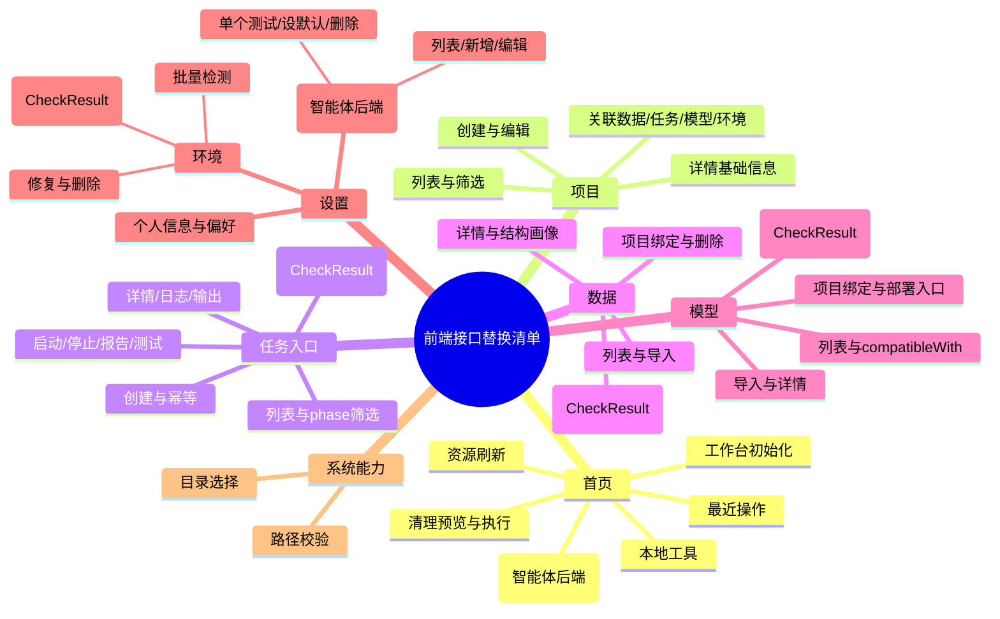

# 前端接口替换文档v2

**前端原型与接口替换点梳理**

**梳理现有 React/Vite 原型的路由、组件、页面状态和 Mock 数据来源，标出后续 API 替换点**

**输出前端接口替换清单，覆盖设置、首页、项目、数据、模型、任务入口**

前端自己可操作的能力直接标为“前端自行处理”。

需要后端提供接口的能力，均在“后续 API 替换点”中列出。后端未定义或当前不归主后端维护的能力，统一标为待确认、预留或智能体后端待设计。

## 总览

六个业务模块：首页 / 项目 / 任务 / 数据 / 模型 / 设置。

固定能力：左侧菜单导航栏、全局 AI 对话入口。

系统能力：本地工具、本地目录选择、本地路径校验。

页面状态口径：

- `loading`：列表、详情、表单提交、检查、预检、测试、清理等加载态。

- `empty`：列表为空、详情资源缺失、检查结果为空、输出为空。

- `pending/running`：检查中、任务运行中、修复中、清理中、测试中。

- `error`：接口失败、路径错误、参数校验失败、权限失效、后端内部错误。

- `confirm`：删除、启动、停止、修复、清理等高风险确认。

说明：页面状态是前端 UI 状态，不等同于后端检查结果枚举。后端 `CheckResult.status` 使用 `pass`、`warning`、`failed`、`checking`；前端可映射为 success / warning / failed / pending 等展示态。

统一后端约定：

- 成功输出：`success=true`、`data`、`error=null`、`requestId`。

- 失败输出：`success=false`、`data=null`、`error.code`、`error.message`、`error.detail`、`error.suggestion`、`requestId`。

- 通用错误码：`unauthorized`、`validation_error`、`not_found`、`path_not_found`、`path_not_allowed`、`environment_not_ready`、`dataset_invalid`、`model_invalid`、`process_start_failed`、`task_not_cancellable`、`confirm_required`、`idempotency_conflict`、`future_not_supported`、`internal_error`。

- 高风险确认请求：必须传 `confirmed: true`；可按后端统一约定附带 `confirmText`、`confirmToken`、`riskSummary`。创建、启动、停止、生成报告等可能重复提交的接口支持 `Idempotency-Key` 请求头或请求体 `idempotencyKey`。

## 思维导图

## 1\. 固定

### 左侧菜单导航栏

负责路由控制，固定不变。

前端自行处理：

- 菜单高亮。

- 路由跳转。

- 一级模块切换：首页、项目、任务、数据、模型、设置。

后续 API 替换点：无直接后端接口。

### **AI 对话模块（优化）**

要求两套，逻辑组件和UI组件

右侧 AI 对话在项目、任务、数据、模型、设置中复用；首页 AI 工作台在中间区域展示。

当前口径：AI 相关接口从主后端业务接口中剔除，由智能体后端独立设计和维护。本文档只保留前端入口、页面状态和与业务上下文的衔接说明；具体 AI 对话与模型配置接口见 `docs/AI对话与智能体接口替换详解.md` 与 `后端ai助手数据库与接口文档.md`。

组件方面：

- AI 输入框。

- 附件上传。

- Plan 模式。

- Skills 查看。

- 权限模式。

- 当前项目上下文。

- 页面上下文传递。

页面状态：

- 对话发送中。

- 生成计划中。

- 动作建议加载中。

- 附件上传中。

- AI 模型不可用。

- 权限模式冲突。

- 高风险动作待确认。

- 智能体后端不可用。

- AI 接口契约待补。

Mock 数据来源：

- 预置推荐问题。

- 预置模型列表。

- 预置权限模式。

- 预置 Skills。

- 页面上下文 Mock。

后续 API 替换点：

|来源|接口/能力|前端替换位置|说明|
|---|---|---|---|
|智能体后端待设计|AI 对话发送|首页 AI 工作台、右侧 AI 对话|主后端不再提供 `/api/assistant/chat` |
|智能体后端待设计|Plan 模式|Plan 模式|主后端不再提供 `/api/assistant/plans` |
|智能体后端待设计|AI 动作建议/应用|任务诊断、数据分析、模型检查、环境建议|业务动作最终仍需走对应业务模块后端接口 |
|智能体后端待设计|附件上传|AI 输入附件|是否复用文件服务由智能体后端确认 |
|智能体后端待设计|Skills / 工具能力|Skills 查看、工具调用说明|主后端不再维护 Skills 接口 |
|智能体后端文档|AI 模型配置接口|设置页 AI 模型配置|见 `后端ai助手数据库与接口文档.md` |

边界限制：

- AI 动作不能绕过业务模块确认，真正创建、删除、启动、停止、修复等操作仍走主后端业务接口。

- 上传附件大小、格式和敏感文件需要前端提示，后端校验。

- 权限模式以前端当前选择为准。

- 默认 AI 模型不可用时，对话按钮需要提示用户去设置配置模型。

- 主后端接口索引不再统计 AI 对话、Plan、Skills、权限模式等接口。

## 2\. 首页

### 路由方面

首页路由为空路径 `/`。

### 组件方面

- AI 工作台：

    - 操作集成：上传附件 / Plan 模式 / 装载 Skills。

    - 权限管理：只读建议 / 辅助填写 / 确认后执行。

    - 模型选择。

    - 当前项目选择。

    - 提示词推荐。

- 本机资源概览：

    - CPU / GPU / 内存。

    - 当前网速。

    - 磁盘可用空间。

    - 深度加速 / 垃圾清理。

    - 最近操作。

- 本地工具启动器：

    - VS Code / Visual Studio / Cursor / File Explorer / Terminal / WSL。

### 页面状态

- 首页初始化 loading。

- 资源实时刷新 loading / stale。

- 最近操作 empty。

- 清理预览 pending。

- 清理执行 confirm / running / success / error。

- 本地工具打开失败。

- 未登录或 token 无效。

### Mock 数据来源

- AI 工作台：提示词推荐、模型选择、Skills 由智能体后端/前端配置侧维护；首页主后端只返回当前项目、资源和最近操作。

- 本机资源概览：CPU、GPU、内存、磁盘、网络。

- 清理能力：可清理路径、可释放空间、清理警告。

- 最近操作：项目、任务、数据、模型、环境操作记录。

- 本地工具：工具名称、当前项目路径。

### 后续 API 替换点

|后端章节|后端接口|前端替换位置|输入/参数|输出关注|
|---|---|---|---|---|
|1\.1|`GET /api/home/workbench`|首页初始化|`currentProjectId`、`includeResources`、`recentLimit`|`currentProject`、`resources`、`recentActions`|
|1\.2|`GET /api/system/resources`|本机资源概览实时刷新|无|CPU、GPU、内存、磁盘、网络|
|1\.3|`GET /api/activity/recent`|最近操作|`limit`、`projectId`|`items[].resourceType`、`resourceId`、`tone`|
|1\.4|`POST /api/system/cleanup/preview`|垃圾清理分析|`scope`、`projectId`|`releasableSize`、`items`、`warnings`|
|1\.5|`POST /api/system/cleanup`|执行清理|`confirmed=true`、`paths`|`cleanedSize`、`cleanedCount`、`skipped`|
|1\.6|`POST /api/local-tools/open`|本地工具启动器|`tool`、`projectId`、`path`|`opened`、`tool`、`path`|

### 边界限制

- 接口失败：首页应允许展示静态骨架或错误提示，不应阻塞用户输入 AI 问题。

- 部分字段为空：资源、最近操作、Skills 可分别展示空态，不能导致整个首页不可用。

- 当前项目不存在：显示“未选择项目”或默认工作区状态。

- AI 模型列表为空：AI 输入保留，但模型配置状态由智能体后端/AI 模块处理。

- 清理接口必须走预览再执行，执行必须传 `confirmed: true`。

- 未登录或 token 无效：后端返回 `unauthorized` 时进入登录态处理，不继续发起首页业务请求。

## 3\. 项目

### 路由方面

- `/projects`：项目列表页。

- `/projects/:projectId`：项目详情页。

### 组件方面

- 项目搜索。

- 项目类型筛选。

- 项目状态筛选。

- 项目卡片列表。

- 分页。

- 创建项目弹窗/抽屉。

- 项目详情。

- 项目概览 / 操作记录 / 任务记录 / 模型资产 Tab。

- 项目 AI 助手。

### 页面状态

- 列表 loading / empty / error。

- 筛选 pending。

- 创建项目表单 loading / validation\_error。

- 项目详情 loading / not\_found。

- 删除项目 confirm / running / success / error。

### Mock 数据来源

- 项目列表：项目名称、类型、状态、工作区、数据集、环境、更新时间。

- 项目规格：项目类型、代码来源、默认路径。

- 项目详情：基础信息、关联数据、任务、模型、环境摘要。

### 后续 API 替换点

|后端章节|后端接口|前端替换位置|输入/参数|输出关注|
|---|---|---|---|---|
|2\.1|`GET /api/projects`|项目列表、筛选、分页|`keyword`、`type`、`status`、`page`、`pageSize`|`items`、`total`|
|2\.2|`GET /api/projects/specs`|创建项目表单初始化|无|`projectTypes`、`codeSources`、`workspaceOptions`|
|2\.3|`POST /api/projects`|创建项目|`name`、`type`、`workspace`、`codeSource`、`codePath`、`datasetIds`、`environmentId`|新项目 ID、状态|
|2\.4|`GET /api/projects/{projectId}`|项目详情基础信息|`projectId`|基础信息、`datasetCount`、`taskCount`、`modelCount`、`environmentId`、`summary`|
|4\.1 / 3\.1 / 5\.1 / 7\.1|关联资源列表与默认环境|项目详情 Tab|`projectId`、`envId`|`GET /api/datasets?projectId=...`、`GET /api/tasks?projectId=...`、`GET /api/models?projectId=...`；默认环境详情接口待后端补充，当前可从环境列表字段兜底展示|
|2\.5|`PATCH /api/projects/{projectId}`|编辑项目|局部字段、`datasetIds`、`environmentId`|更新后的项目对象|
|2\.6|`DELETE /api/projects/{projectId}`|删除项目|`confirmed=true`、`deleteLocalFiles=false`|`deleted`、`projectId`|

### 边界限制

- 项目名称重复或路径不可写时展示字段级错误。

- 删除项目默认不删除本地文件；MVP 阶段 `deleteLocalFiles` 只允许为 `false`，前端应隐藏或禁用“删除本地文件”选项，传 `true` 时后端返回 `future_not_supported` 或 `validation_error`。

- 项目详情基础接口只返回计数、默认环境 ID 和摘要；关联数据、任务、模型列表不由项目详情内嵌返回，完整列表、筛选、分页应回到数据、任务、模型模块接口，默认环境详情调用环境接口。

- 关联数据集或环境不存在时，需要提示重新绑定。

## 4\. 任务

### 路由方面

- `/tasks`：任务列表页。

- `/tasks/:taskId`：任务详情页。

- `/tasks/:taskId/test`：部署测试页。

### 组件方面

- 任务搜索。

- 任务类型筛选。

- 项目筛选。

- 状态筛选。

- 任务卡片列表。

- 创建训练任务表单。

- 创建部署任务表单。

- 任务详情 Tab：任务概览 / 配置参数 / 日志与诊断 / 输出结果。

- 任务操作：启动、停止、复制、重试、登记模型。

- 任务报告：生成报告、报告列表、报告详情。

- 部署测试表单。

- 任务 AI 助手。

### 页面状态

- 列表 loading / empty / error。

- 创建任务表单 loading / validation\_error。

- 预检 pending / pass / warning / failed。

- 任务运行中 polling。

- 日志加载中 / 日志为空 / 日志过大。

- 日志分页 / 游标加载 / tail 模式。

- 输出结果 empty。

- 报告生成 pending / generating / generated / generate_failed。

- 启动任务 confirm / starting。

- 停止任务 confirm / stopping。

- 删除任务 confirm / deleting。

- 部署测试 pending / success / error。

### Mock 数据来源

- 任务列表：任务类型、任务状态、项目、数据集、环境。

- 任务规格：训练类型、部署类型、动态字段。

- 任务详情：指标、步骤、上下文、endpoint。

- 日志与输出：分页日志 lines、nextCursor、diagnosis、artifacts、reportsUrl。

### 后续 API 替换点

|后端章节|后端接口|前端替换位置|输入/参数|输出关注|
|---|---|---|---|---|
|3\.1|`GET /api/tasks`|任务列表、筛选、分页|`keyword`、`kind`、`type`、`projectId`、`status`、`phase`、`page`、`pageSize`|`items`、`total`|
|3\.2|`GET /api/tasks/specs`|创建训练/部署任务表单|`kind`、`type`、`projectId`、`modelAssetId`|`trainingTypes`、`deploymentTypes`、`fields`|
|3\.3|`POST /api/tasks/preflight`|启动前检查|`kind`、`type`、`projectId`、`datasetId`、`modelAssetId`、`environmentId`、`execution`|`CheckResult`：`status`、`summary`、`items`、`checkedAt`、`source`、`warnings`|
|3\.4|`POST /api/tasks`|创建任务|训练/部署任务配置、`startImmediately`、`idempotencyKey`|`id`、`kind`、`status`、`pollUrl`、`logsUrl`|
|3\.5|`GET /api/tasks/{taskId}`|任务详情概览|`taskId`|基础信息、状态、指标、步骤、`canStart/canStop/canClone/canEdit/canDelete`、`errorCode/exitCode/stoppedReason`|
|3\.6|`GET /api/tasks/{taskId}/config`|配置参数 Tab|`taskId`|`taskInfo`、`execution`、`basic`、`advanced`|
|3\.7|`GET /api/tasks/{taskId}/logs`|日志与诊断 Tab|`taskId`、`cursor`、`limit`、`direction`、`keyword`、`level`、`fromTime`、`toTime`、`tail`|`lines`、`nextCursor`、`hasMore`、`truncated`、`exportUrl`、`diagnosis`|
|3\.8|`GET /api/tasks/{taskId}/outputs`|输出结果 Tab|`taskId`|`artifacts`、`registeredModelId`、`endpoint`、`reportsUrl`|
|3\.9|`POST /api/tasks/{taskId}/reports`|生成任务报告|`reportType`、`format`、`idempotencyKey`|报告对象|
|3\.9|`GET /api/tasks/{taskId}/reports`|查询任务报告列表|`taskId`|报告列表|
|3\.9|`GET /api/reports/{reportId}`|查询报告详情|`reportId`|报告对象|
|3\.10|`POST /api/tasks/{taskId}/start`|启动任务|`confirmed=true`、`idempotencyKey`|`status`、`phase`、`pid`、`startedAt`、`canStart`、`canStop`|
|3\.11|`POST /api/tasks/{taskId}/stop`|停止任务|`confirmed=true`、`idempotencyKey`|`status`、`phase`、`stoppedReason`、`endedAt`、`canClone`|
|3\.12|`DELETE /api/tasks/{taskId}`|删除任务|`confirmed=true`、`deleteLocalFiles=false`|`deleted`、`taskId`|
|3\.13|`POST /api/tasks/{taskId}/clone`|复制为新任务|路径参数 `taskId`|`draft`|
|3\.13|`POST /api/tasks/{taskId}/retry`|重试任务|路径参数 `taskId`|`draft`|
|3\.14|`POST /api/tasks/{taskId}/register-model`|登记训练产物为模型|`artifactPath`、`name`、`type`|`modelId`|
|3\.15|`GET /api/tasks/{taskId}/test-spec`|部署测试表单初始化|`taskId`|`endpoint`、`method`、`fields`|
|3\.16|`POST /api/tasks/{taskId}/test`|测试部署任务|`payload`|`statusCode`、`latencyMs`、`response`|

### 边界限制

- 创建任务前必须先预检。

- 启动任务和停止任务都是高风险操作，必须传 `confirmed: true`，并建议使用 `idempotencyKey` 防重复提交。

- 复制/重试只生成草稿，不应直接启动。

- 任务日志已支持分页、游标、关键词、level、时间范围和 tail 模式；前端应保存 `nextCursor` 并处理 `truncated`。

- 后端当前提供日志查询接口；SSE / WebSocket 实时推送不是已定契约，如前端需要实时流式日志，应作为后续待确认能力。

- 删除任务接口已由后端正文补齐；MVP 阶段 `deleteLocalFiles` 只允许为 `false`，不删除数据集、模型资产或本机输出文件。

## 5\. 数据

### 路由方面

- `/data`：数据集列表页。

- `/data/import`：导入数据集。

- `/data/:datasetId`：数据集详情页。

### 组件方面

- 数据集搜索。

- 数据类型筛选。

- 状态筛选。

- 数据集卡片列表。

- 导入数据集表单。

- 绑定项目弹窗。

- 数据详情。

- 结构画像。

- AI 数据检查摘要。

- 数据 AI 助手。

### 页面状态

- 列表 loading / empty / error。

- 导入表单 validation\_error。

- 路径校验 pending。

- 数据检查 pending / warning / failed / success。

- 绑定项目 pending。

- 删除数据集 confirm。

### Mock 数据来源

- 数据集列表：名称、类型、路径、格式、样本数、状态、项目。

- 导入表单：数据类型、格式、标注文件、项目候选。

- 数据详情：基础信息、目录结构、检查摘要。

### 后续 API 替换点

|后端章节|后端接口|前端替换位置|输入/参数|输出关注|
|---|---|---|---|---|
|4\.1|`GET /api/datasets`|数据集列表、筛选、分页|`keyword`、`type`、`status`、`projectId`、`page`、`pageSize`|`items`、`total`|
|4\.2|`POST /api/datasets`|导入数据集|`name`、`type`、`path`、`format`、`annotation`、`projectIds`、`autoCheck`|`id`、`status`|
|4\.3|`GET /api/datasets/{datasetId}`|数据集详情|`datasetId`|数据集详情对象|
|4\.4|`GET /api/datasets/{datasetId}/profile`|结构画像|`datasetId`|`structureTitle`、`structure`、`checkScope`|
|4\.5|`POST /api/datasets/{datasetId}/check`|检查数据集|`datasetId`|`CheckResult`：`status`、`summary`、`items`、`checkedAt`、`source`、`warnings`|
|4\.6|`GET /api/datasets/{datasetId}/check-result`|检查结果|`datasetId`|最近一次检查结果|
|4\.7|`PATCH /api/datasets/{datasetId}/projects`|更新绑定项目|`projectIds`|更新后的数据集对象|
|4\.8|`DELETE /api/datasets/{datasetId}`|删除数据集|`confirmed=true`、`deleteLocalFiles=false`|`deleted`|

### 边界限制

- 删除数据集默认只删除登记记录，不删除本地数据文件。

- 数据集路径不存在时返回 `path_not_found`。

- 数据格式或标注校验失败时返回 `dataset_invalid`。

- 检查耗时较长时，前端需要预留 pending 状态；重复触发、异步任务查询或取消检查策略后端未单独展开，当前仅做待确认提示。

## 6\. 模型

### 路由方面

- `/models`：模型资产列表页。

- `/models/import`：导入模型。

- `/models/:modelId`：模型详情页。

### 组件方面

- 模型搜索。

- 模型类型筛选。

- 状态筛选。

- 模型卡片列表。

- 导入模型表单。

- 绑定项目弹窗。

- 模型详情。

- 检查与部署建议。

- 创建部署任务入口。

- 模型 AI 助手。

### 页面状态

- 列表 loading / empty / error。

- 导入表单 validation\_error。

- 路径校验 pending。

- 模型检查 pending / warning / failed / success。

- 删除模型 confirm。

- 创建部署任务跳转中。

### Mock 数据来源

- 模型列表：名称、类型、来源、路径、格式、状态。

- 导入表单：模型类型、格式、框架、精度、推荐环境。

- 模型详情：来源任务、关联项目、检查结果、部署建议。

### 后续 API 替换点

|后端章节|后端接口|前端替换位置|输入/参数|输出关注|
|---|---|---|---|---|
|5\.1|`GET /api/models`|模型列表、筛选、分页|`keyword`、`type`、`status`、`projectId`、`compatibleWith`、`page`、`pageSize`|`items`、`total`|
|5\.2|`POST /api/models`|导入模型|`name`、`type`、`source`、`path`、`format`、`framework`、`precision`、`projectIds`、`recommendedEnvironmentId`、`autoCheck`|`id`、`status`|
|5\.3|`GET /api/models/{modelId}`|模型详情|`modelId`|模型详情对象|
|5\.4|`POST /api/models/{modelId}/check`|检查模型|`modelId`|`CheckResult`：`status`、`summary`、`items`、`checkedAt`、`source`、`warnings`|
|5\.5|`GET /api/models/{modelId}/check-result`|模型检查结果|`modelId`|最近一次检查结果|
|5\.6|`PATCH /api/models/{modelId}/projects`|更新绑定项目|`projectIds`|更新后的模型对象|
|5\.7|`DELETE /api/models/{modelId}`|删除模型|`confirmed=true`、`deleteLocalFiles=false`|删除结果|

### 边界限制

- 删除模型默认只删除登记记录，不删除本地模型文件。

- 删除模型对已关联部署任务的影响后端未单独展开，前端删除确认文案需提示“关联部署影响待确认”，正式阻断规则由后端补充。

- 模型文件或配置不可用时返回 `model_invalid`。

- Adapter 模型、Tokenizer、Config、基础模型缺失时应显示警告。

- 创建部署任务归任务模块处理，模型模块只传 `modelAssetId` 上下文。

## 7\. 设置

### 路由方面

- `/settings`：运行环境页签。

- `/settings?tab=assistant`：AI 助手配置页签。

- `/settings?tab=profile`：个人信息与偏好页签。

### 组件方面

- 环境列表。

- 环境详情抽屉。

- 创建环境表单。

- 导入本地环境表单。

- 检测环境。

- 批量检测环境。

- 修复环境。

- AI 模型配置入口：接口由智能体后端维护，详见 `AI对话与智能体接口替换详解.md`。

- 个人信息表单。

- 偏好配置表单。

### 页面状态

- 环境列表 loading / empty / error。

- 环境检测 pending。

- 批量环境检测 pending / running / completed / partial_failed / failed。

- 环境修复 confirm / running。

- 个人信息保存 pending。

- 偏好保存 pending。

### Mock 数据来源

- 环境：名称、用途、Python、框架、CUDA、状态、检测结果。

- AI 模型配置：不再归主后端接口；由智能体后端文档维护。

- 个人信息：账号 ID、邮箱、手机号。

- 偏好配置：主题、语言、默认工作区、确认策略。

### 后续 API 替换点

#### 7\.1 设置 \- 运行环境

运行环境接口由业务后端提供，默认 Base URL 为 `http://10.0.1.5:8000`。前端可通过 `VITE_ENVIRONMENTS_API_BASE_URL` 单独覆盖；开发环境中 `/api/environments` 和 `/api/health` 由 Vite proxy 转发到 `8000`，AI / chat 相关 `/api` 仍转发到 `8765`。

|后端章节|后端接口|前端替换位置|输入/参数|输出关注|前端状态|
|---|---|---|---|---|---|
|7\.1|`GET /api/environments`|环境列表、筛选、分页|`status=all/available/unavailable`、`page`、`pageSize`|`items[]`、`statusText`、`pythonVersion`、`dependencySummary`、`canDeleteLocalFiles`|已接入|
|7\.2|`POST /api/environments`|创建系统环境|请求头 `Idempotency-Key`；`mode=system`、`category=llm_inference`、`taskType=llm`、`autoCheck`、`confirmed=true`|`environment` 摘要、后台 `job` 摘要|已接入|
|7\.2|`POST /api/environments`|创建自定义环境|请求头 `Idempotency-Key`；`mode=custom`、`name`、`purpose`、`python`、`packageManager`、`savePath`、`packageSource`、`dependencyFilePath`、`packages=[]`、`autoCheck`、`confirmed=true`|`environment` 摘要、后台 `job` 摘要|已接入|
|7\.3|`POST /api/environments/import`|导入本地环境|`name`、`purpose`、`environmentPath`、`pythonPath`、`environmentManager`、`condaEnvName`、`autoCheck`|导入后的环境对象|已接入|
|7\.4|`POST /api/environments/{envId}/check`|检测环境|`envId`|`CheckResult`：`status`、`summary`、`items`、`checkedAt`、`source`、`warnings`|文档已定义；当前运行 OpenAPI 暂未暴露时前端提示不可用|
|7\.5|`POST /api/environments/{envId}/repair`|修复环境|`confirmed=true`、`strategy`|`repairTaskId`、`repairStatus`|待接入|
|7\.6|`DELETE /api/environments/{envId}`|删除环境|`confirmed=true`、`deleteLocalFiles`、`deleteLocalFilesConfirmed`|`deleted`、`localFilesDeleted`|已接入|

创建环境落地规则：

- 系统环境当前只允许“大模型推理 / LLM”，前端不提交环境名称和保存路径，由后端生成。
- 创建系统环境和自定义环境都属于高风险、长耗时操作，必须展示确认并提交 `confirmed=true`。
- 创建请求必须带 `Idempotency-Key`，避免用户重复点击导致重复创建。
- 创建接口只登记环境记录并创建后台任务，HTTP 响应不代表 Conda / venv 和依赖安装已经完成；前端应展示“创建任务已提交”语义。
- 自定义环境的 `packageManager` 使用后端枚举：`conda`、`uv`、`pip`、`mamba`、`conda_pip`、`venv`；前端的 `conda+pip` 需映射为 `conda_pip`。
- 删除本地 Conda 环境按钮只在列表项 `canDeleteLocalFiles=true` 时可用；最终仍由后端根据 `environmentManager` 和路径重新校验。

#### 7\.2 设置 \- AI 模型配置

AI 模型配置接口已从主后端接口文档中剔除，由智能体后端负责设计和维护。前端设置页仍保留 AI 模型配置入口；以下替换点不计入主后端业务接口一一对应索引，但必须纳入设置页前端实施清单。当前 AI 助手配置不规划“搜索模型”和“检测全部模型”功能。

详见：
- `docs/AI对话与智能体接口替换详解.md`
- `后端ai助手数据库与接口文档.md`

|来源|接口|前端替换位置|输入/参数|输出关注|
|---|---|---|---|---|
|智能体后端|`GET /api/settings/assistant/models`|AI 模型配置列表、模型选择器|无|`id`、`name`、`vendor`、`provider`、`endpoint`、`apiKeyMasked`、`modelId`、`contextLength`、`maxOutput`、`temperature`、`status`、`isDefault`、`lastTestAt`、`errorMessage`|
|智能体后端|`POST /api/settings/assistant/models`|新增 AI 模型配置|`name`、`vendor`、`endpoint`、`apiKey`、`modelId`、`contextLength`、`temperature`、`maxOutput`|新增后的模型配置；查询时只展示 `apiKeyMasked`|
|智能体后端|`PATCH /api/settings/assistant/models/{id}`|编辑 AI 模型配置|局部字段；`apiKey` 仅在用户重新填写时提交|更新后的模型配置，测试状态可能回到 `pending_check`|
|智能体后端|`POST /api/settings/assistant/models/{id}/set-default`|设为默认模型|路径参数 `id`|默认模型配置；默认模型用于首页对话、全局助手和 Plan 模式|
|智能体后端|`POST /api/settings/assistant/models/{id}/test`|测试 AI 模型连接|路径参数 `id`；临时未保存配置测试待智能体后端确认|`status`、`message`、`lastTestAt`|
|智能体后端|`DELETE /api/settings/assistant/models/{id}?confirmed=true`|删除 AI 模型配置|路径参数 `id`、查询参数 `confirmed=true`|`deleted`；默认模型不能直接删除，需先切换默认模型|

#### 7\.3 设置 \- 个人信息与偏好

|后端章节|后端接口|前端替换位置|输入/参数|输出关注|
|---|---|---|---|---|
|8\.1|`GET /api/settings/profile`|查询个人信息|无|`accountId`、`email`、`phone`|
|8\.2|`PATCH /api/settings/profile`|保存个人信息|`accountId`、`email`、`phone`|更新后的个人信息|
|8\.3|`GET /api/settings/preferences`|查询偏好配置|无|`theme`、`language`、`defaultWorkspace`、`confirmPolicy`|
|8\.4|`PATCH /api/settings/preferences`|保存偏好配置|`theme`、`language`、`defaultWorkspace`、`confirmPolicy`|更新后的偏好配置|

小提示：原型/OpenSpec 曾提到默认数据路径、默认模型路径、默认导出路径、默认项目、界面密度、路径显示等偏好字段；当前后端接口文档尚未定义这些字段，前端不应按已定契约实现，需产品/后端确认后再补充。

### 边界限制

- 环境修复、环境删除必须传 `confirmed: true`。

- 检测环境是低风险读检查；文档定义 `POST /api/environments/{envId}/check` 返回 `CheckResult`，当前运行 OpenAPI 暂未暴露时前端应提示不可用。

- AI 模型配置的 API Key 脱敏、默认模型删除限制等由智能体后端文档约束。

- 个人信息需要邮箱、手机号格式校验。

- 偏好中的默认路径不存在时应提示重新选择。

- 对话和 Plan 模式需要可用默认模型；单个模型连接测试不应依赖其是否默认，除非智能体后端另行确认。非默认模型测试失败时展示失败原因和 `requestId`。

## 8\. 遗漏补缺

### 8\.1 登录状态以及鉴权

当前 `后端接口文档.md` 已定义通用错误码 `unauthorized`，说明“未登录或 token 无效”；设置个人信息接口也提到“用户已登录或处于本地单用户模式”。但后端文档尚未定义登录、会话校验、刷新 token、退出登录等接口。

本轮先预留登录与鉴权空间，不把它展开为完整登录模块。

边界情况：

- 本地单用户模式：如果 MVP 不要求登录，仍建议 `GET /api/auth/session` 返回本地用户和模式，避免前端写死 admin。

- token 失效：任何接口返回 `unauthorized` 时，应清理本地会话并跳转登录或展示重新登录弹窗。

- 权限不足：如果后续区分角色，建议补充 `forbidden` 或权限不足错误码；当前错误码只有 `unauthorized`。

- 多窗口登录状态变化：一个窗口退出登录后，其他窗口应在下一次接口失败或会话轮询时同步状态。

- 高风险操作二次确认不等同于登录鉴权；即使已登录，清理、修复、删除等仍需要 `confirmed: true`。

### 8\.2 后端已列出但契约待补

|事项|当前后端依据|预留说明|
|---|---|---|
|AI 对话、Plan、动作建议、Skills、权限模式|已从主后端接口文档剔除|由智能体后端独立设计；本文档不再把 `/api/assistant/*` 计入主后端接口索引|
|AI 模型配置|由 `后端ai助手数据库与接口文档.md` 维护|设置页保留入口、页面状态和接口索引，生命周期接口归智能体后端维护|
|登录状态以及鉴权|主后端仅保留 `unauthorized` 错误码|登录、会话、刷新 token、退出登录接口仍待补正式契约|

### 8\.3 系统文件与路径能力

这些能力不是六个主业务模块，但会被创建项目、导入数据、导入模型、创建环境等表单复用。

|后端章节|后端接口|前端替换位置|输入/参数|输出关注|
|---|---|---|---|---|
|8\.1|`POST /api/local-files/pick-directory`|选择项目工作区、数据目录、模型目录、环境保存路径|`title`、`defaultPath`|`path`|
|8\.2|`POST /api/local-files/validate-path`|所有本地路径表单校验|`path`、`expect`、`permission`|`ok`、`exists`、`type`、`allowed`|

落地提示：创建项目、导入数据、导入模型、创建/导入环境等涉及本地路径的表单，提交前应调用 `POST /api/local-files/validate-path`；按场景传入 `expect=file/directory` 和 `permission=read/write`，不要只依赖目录选择器返回值。

## 9\. 后端接口一一对应索引

|后端模块|后端接口数量|已纳入前端替换清单|
|---|---|---|
|1\. 首页|6|是|
|2\. 项目|6|是|
|3\. 任务|19|是|
|4\. 数据|8|是|
|5\. 模型|7|是|
|6\. 设置 \- 运行环境|9|是|
|7\. 设置 \- 个人信息与偏好|4|是|
|8\. 系统文件与路径能力|2|是|
|AI 相关接口|独立文档维护|不计入主后端接口索引|

接口明细：

|序号|后端章节|接口|
|---|---|---|
|1|1\.1|`GET /api/home/workbench`|
|2|1\.2|`GET /api/system/resources`|
|3|1\.3|`GET /api/activity/recent`|
|4|1\.4|`POST /api/system/cleanup/preview`|
|5|1\.5|`POST /api/system/cleanup`|
|6|1\.6|`POST /api/local-tools/open`|
|7|2\.1|`GET /api/projects`|
|8|2\.2|`GET /api/projects/specs`|
|9|2\.3|`POST /api/projects`|
|10|2\.4|`GET /api/projects/{projectId}`|
|11|2\.5|`PATCH /api/projects/{projectId}`|
|12|2\.6|`DELETE /api/projects/{projectId}`|
|13|3\.1|`GET /api/tasks`|
|14|3\.2|`GET /api/tasks/specs`|
|15|3\.3|`POST /api/tasks/preflight`|
|16|3\.4|`POST /api/tasks`|
|17|3\.5|`GET /api/tasks/{taskId}`|
|18|3\.6|`GET /api/tasks/{taskId}/config`|
|19|3\.7|`GET /api/tasks/{taskId}/logs`|
|20|3\.8|`GET /api/tasks/{taskId}/outputs`|
|21|3\.9|`POST /api/tasks/{taskId}/reports`|
|22|3\.9|`GET /api/tasks/{taskId}/reports`|
|23|3\.9|`GET /api/reports/{reportId}`|
|24|3\.10|`POST /api/tasks/{taskId}/start`|
|25|3\.11|`POST /api/tasks/{taskId}/stop`|
|26|3\.12|`DELETE /api/tasks/{taskId}`|
|27|3\.13|`POST /api/tasks/{taskId}/clone`|
|28|3\.13|`POST /api/tasks/{taskId}/retry`|
|29|3\.14|`POST /api/tasks/{taskId}/register-model`|
|30|3\.15|`GET /api/tasks/{taskId}/test-spec`|
|31|3\.16|`POST /api/tasks/{taskId}/test`|
|32|4\.1|`GET /api/datasets`|
|33|4\.2|`POST /api/datasets`|
|34|4\.3|`GET /api/datasets/{datasetId}`|
|35|4\.4|`GET /api/datasets/{datasetId}/profile`|
|36|4\.5|`POST /api/datasets/{datasetId}/check`|
|37|4\.6|`GET /api/datasets/{datasetId}/check-result`|
|38|4\.7|`PATCH /api/datasets/{datasetId}/projects`|
|39|4\.8|`DELETE /api/datasets/{datasetId}`|
|40|5\.1|`GET /api/models`|
|41|5\.2|`POST /api/models`|
|42|5\.3|`GET /api/models/{modelId}`|
|43|5\.4|`POST /api/models/{modelId}/check`|
|44|5\.5|`GET /api/models/{modelId}/check-result`|
|45|5\.6|`PATCH /api/models/{modelId}/projects`|
|46|5\.7|`DELETE /api/models/{modelId}`|
|47|7\.1|`GET /api/environments`|
|48|7\.2|`POST /api/environments`|
|49|7\.3|`POST /api/environments/import`|
|50|7\.4|`POST /api/environments/{envId}/check`|
|51|7\.5|`POST /api/environments/{envId}/repair`|
|52|7\.6|`DELETE /api/environments/{envId}`|
|53|8\.1|`GET /api/settings/profile`|
|54|8\.2|`PATCH /api/settings/profile`|
|55|8\.3|`GET /api/settings/preferences`|
|56|8\.4|`PATCH /api/settings/preferences`|
|57|9\.1|`POST /api/local-files/pick-directory`|
|58|9\.2|`POST /api/local-files/validate-path`|
